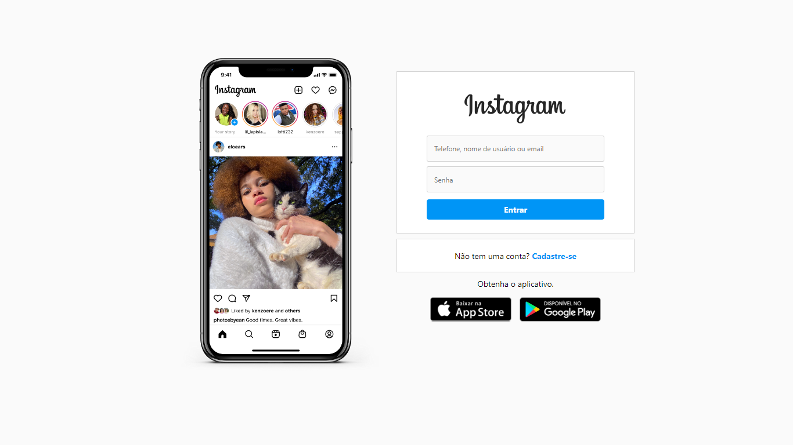
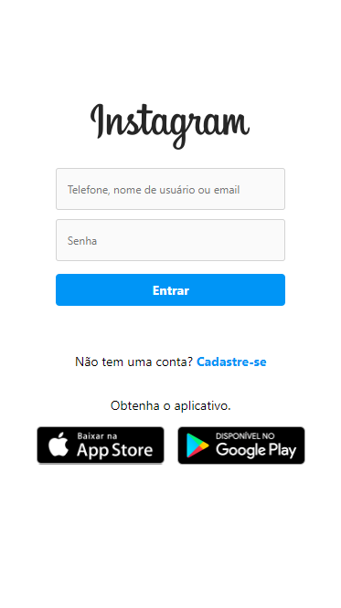

# Recriando a página inicial do Instagram
O projeto utiliza conceitos de [*Flexbox*](https://developer.mozilla.org/pt-BR/docs/Learn/CSS/CSS_layout/Flexbox) e foi desenvolvido como um desafio do 
bootcamp "*HTML Web Developer*" da [DIO](https://www.dio.me/).

## Capturas de tela
<table align="center">
  <tr>
    <th>Desktop</th>
    <th>Mobile</th>
  </tr>
  <tr>
    <td></td>
    <td></td>
  </tr>
</table>
